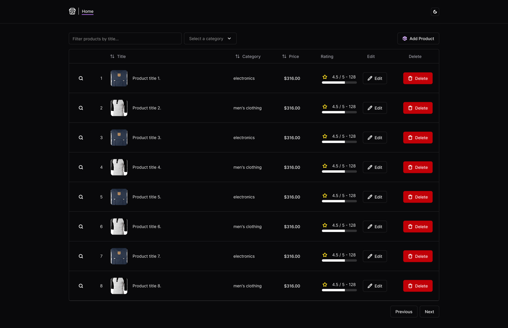

<a name="readme-top"></a>




---

## 📌 About the Project

The **Fake Store Front Panel** is a **CRUD** developed with **Next.js** to manage products, categories, and users using the **FakeStore API**. It uses **React Query** for request optimization, **Jest** for automated testing, and **Storybook** for isolated component development.

🔹 **Key Features**:
- ✅ Create, edit, and delete products  
- ✅ List categories with asynchronous loading  
- ✅ Integration with external API using **React Query**  
- ✅ Unit and integration testing with **Jest**  
- ✅ Component documentation and visualization in **Storybook**  

---

## 🚀 Technologies Used

- **[Next.js](https://nextjs.org/)** - React framework for SSR and SSG
- **[React Query](https://react-query.tanstack.com/)** - Efficient asynchronous state management
- **[Jest](https://jestjs.io/)** - JavaScript testing framework
- **[Storybook](https://storybook.js.org/)** - UI development and documentation tool
- **[TypeScript](https://www.typescriptlang.org/)** - Static typing for safer code
- **[MSW](https://mswjs.io/)** - API mocking for testing

---

## ⚙️ **Setup and Installation Guide**

### **1️⃣ Clone the Repository**
```bash
git clone https://github.com/tlsamaral/fake-store-front.git
cd fake-store-front
```

### **2️⃣ Install Dependencies**
After cloning the repository, install all necessary dependencies:

```bash
npm install
# or
yarn install
```

### **3️⃣ Configure Environment Variables**
The project uses environment variables to connect to the API and other services.

📌 Create a `.env.local` file in the project root and add the following variables:

```bash
NEXT_PUBLIC_API_URL=https://fakestoreapi.com  
NEXT_PUBLIC_ENABLED_API_DELAY=true
```
📌 **Important:** If you keep `NEXT_PUBLIC_ENABLED_API_DELAY=true`, the API responses will be delayed, providing a more immersive **UI & UX** experience.


### Run the Project

```bash
npm run dev
# or
yarn dev
```
Access `http://localhost:3000` to use the system.

---

### **🧪 Running Tests**
The project uses **Jest** for automated testing.

📌 To run all tests:  
```bash
npm run test  
yarn test  
```
📌 To generate a test coverage report:  
```bash
npm run test:coverage  
yarn test:coverage  
```
---

### **📖 Storybook (Component Documentation)**  
**Storybook** allows viewing and developing components in isolation.

📌 To start Storybook:  
```bash
npm run storybook  
yarn storybook  
```
📌 To generate a static version of Storybook:  
```bash
npm run build-storybook  
yarn build-storybook  
```
After starting, open `http://localhost:6006` in your browser to view the components.

---

## 📬 Contact  

📧 Email: [worktalles@hotmail.com](mailto:worktalles@hotmail.com)  
👨‍💻 GitHub: [tlsamaral](https://github.com/tlsamaral)  
🔗 LinkedIn: [Talles Amaral](https://linkedin.com/in/tallesamaral)  
